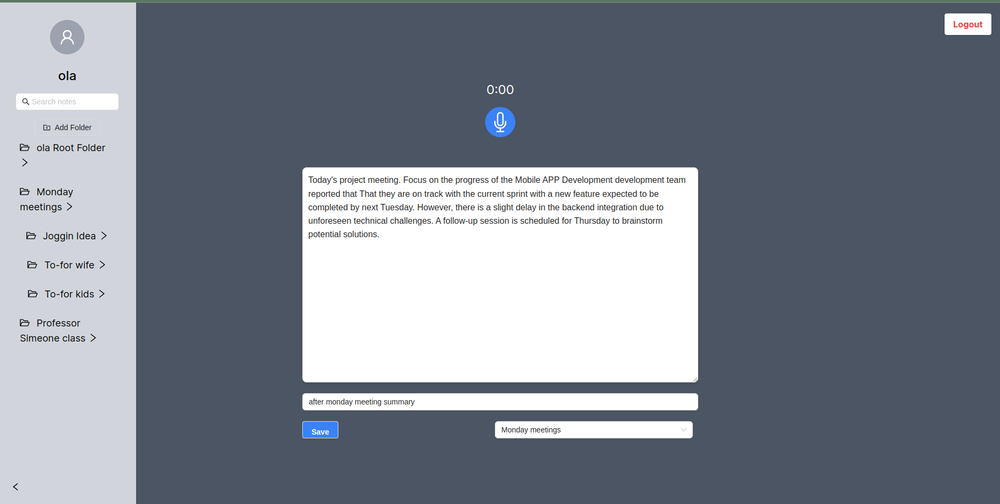

# Veenote

## Overview

Veenote is a web-based application that enables real-time voice-to-text transcription, allowing users to take notes efficiently without the need for manual typing. It leverages WebSocket for real-time audio streaming, AWS Transcribe for voice recognition, and MongoDB for data storage, offering a seamless note-taking experience across various devices.


## Features

- Real-time voice-to-text transcription.
- WebSocket implementation for live audio streaming.
- Integration with AWS Transcribe for accurate voice recognition.
- Persistent storage of notes in MongoDB.
- Cross-platform web application accessible via any modern browser.

## Demo Video
[](https://drive.google.com/file/d/1IuGVNYiMDrU0FATsIwCgTQieVIBOf1Zo/view?usp=sharing)

## Getting Started

### Prerequisites

- Node.js
- MongoDB
- AWS account with access to Transcribe services

### Installation

## 1. Clone the repository:
```bash
    git clone https://github.com/horlami228/Veenote.git
```
## 2. Set up all neccessary credentials

```bash
cd Veenote

```

## 3. Setting up the server
* First install the necessary depencies and setup your credentials
```bash
    cd backend_veenote

    npm install

    touch src/config/config.ts

    touch src/aws/.env
```

### ConfigExample.ts example for database connection
```ts
    export interface DbConfig {
        uri: string;
    }

    export interface Config {
        development: DbConfig;
        production: DbConfig;
    }

    export const config: Config = {
        development: {
            uri: 'mongodb://{{host}}:{{port}}/{{db}}',
        },

        production: {
            uri: process.env.DATABASE_URI || '',
        }
    };
```

### .envExample for aws credentials
```bash
    AWS_ACCESS_KEY_ID=YOUR_ACCESS_KEY_ID
    AWS_SECRET_ACCESS_KEY=YOUR_SECRET_KEY_ID
    AWS_REGION=YOUR_REGION
```

## 4. run the backend expressjs server with npm scripts
* The server runs at port 8000 by default to change port
```bash
    export PORT={{}}
```
* npm script to run
```bash
    npm run start
```

5. run the frontend server using nextjs
* default port is 3000
```bash
    cd frontend_veenote/veenote

    npm install

    npm run start

```
The application will be available at `http://localhost:3000`.

## Usage

1. Navigate to `http://localhost:3000` in your web browser.
2. Start a new note-taking session by clicking the 'Record' button.
3. Speak into your microphone to capture and transcribe your notes in real time.
4. Save your transcription for later reference or further editing by signing up.

## Architecture

- **Client-Side**: Captures audio input and streams it to the server via WebSocket.
- **Server-Side**: Receives audio streams, processes them with AWS Transcribe, and stores the resulting text in MongoDB.
- **Database**: MongoDB is used for storing user notes and respective folders, ensuring data persistence and retrievability.


## License

This project is licensed under the MIT License - see the [LICENSE](/LICENSE) file for details.


## Contact
For any inquiries or further information, reach out to:

- Name: Akintola Olamilekan
- Email: [akintolaolamilekan51@gmail.com](mailto:akintolaolamilekan51@gmail.com)
- GitHub: [github.com/horlami228](https://github.com/horlami228)
